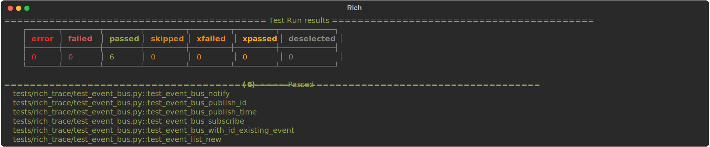
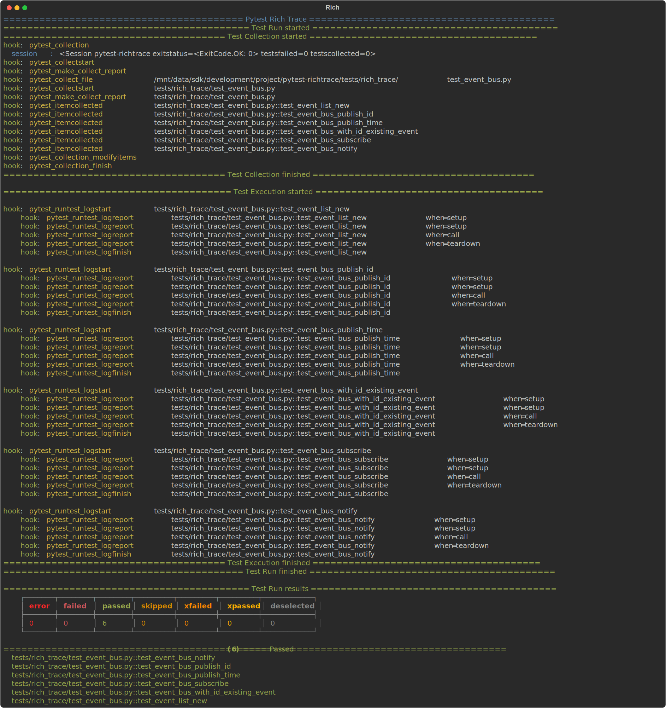
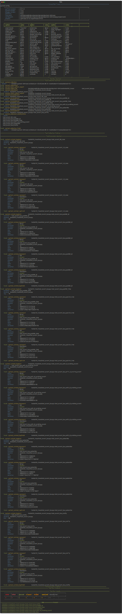
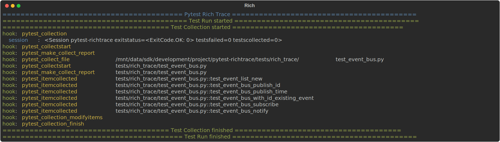

# pytest-richtrace

A pytest plugin that dumps the stages of the pytest testing process to the terminal.

It uses `rich` to add formatting to the output.

## Installation

Install using pip

```shell
pip install pytest_richtrace
```

## Usage

To activate the plugin add the `--rich-trace` option to the `pytest` command line.

## Sample output

### Full test run

#### Quiet output

```shell
pytest --rich-trace -q
```



#### Normal output

```shell
pytest --rich-trace
```



### Verbose output

```shell
pytest --rich-trace --verbose
```



### --collect-only output

```shell
pytest --rich-trace --collect-only
```


