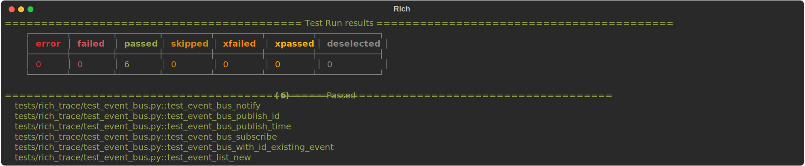
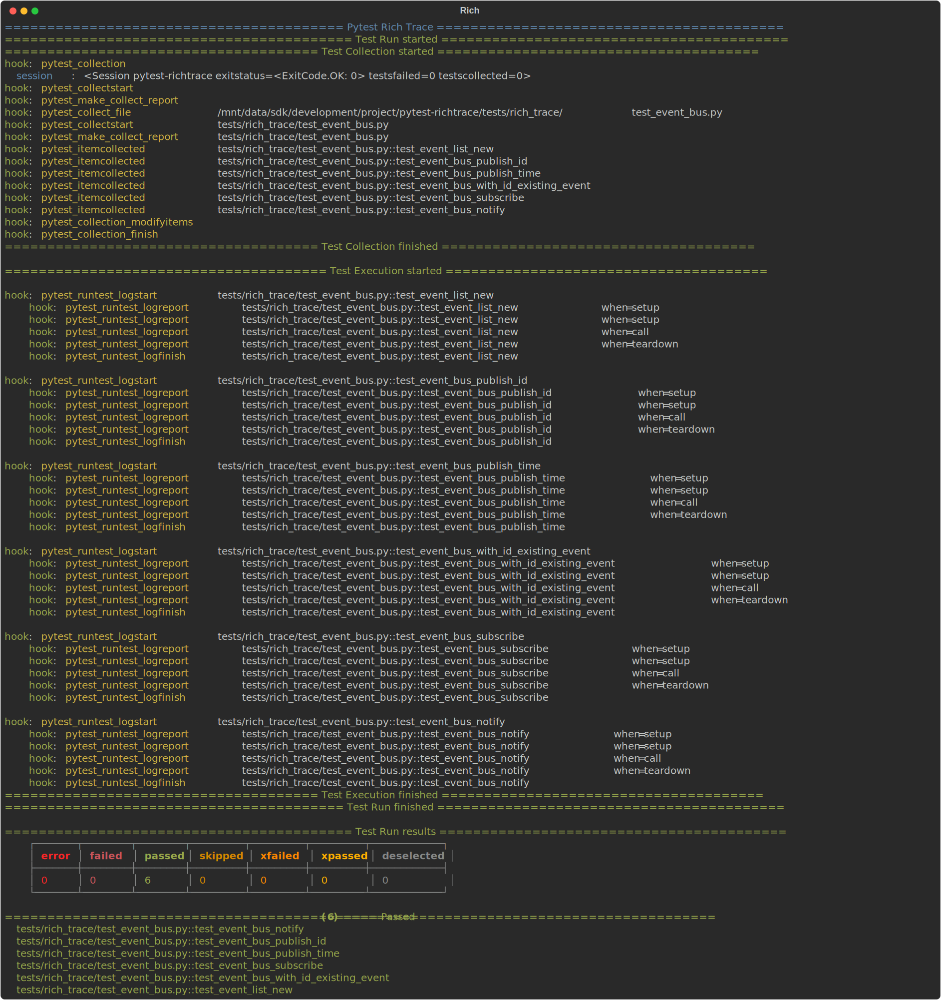
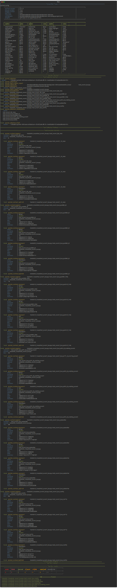
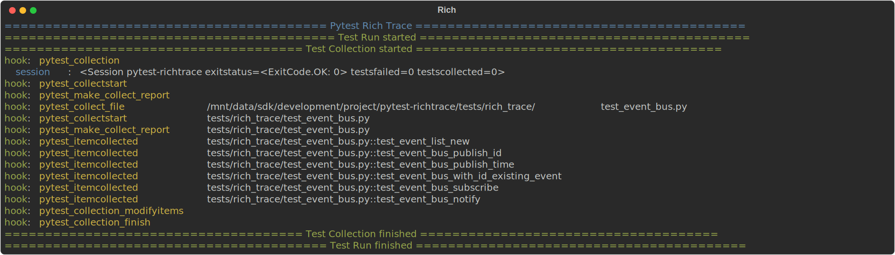

# pytest-richtrace

A [pytest](https://github.com/pytest-dev/pytest) plugin that dumps the stages
of the pytest testing process to the terminal.

It uses [rich](https://github.com/textualize/rich) to add fancy formatting to the output.

## Installation and Usage

Install using `pip`

```shell
pip install pytest-richtrace
```

To activate the plugin pass the `--rich-trace` flag to `pytest`

## Sample output

### Quiet output

```shell
pytest --rich-trace -q
```

{: style="width:70rem" }

### Normal output

```shell
pytest --rich-trace
```

{: style="width:70rem" }

### Verbose output

```shell
pytest --rich-trace --verbose
```

{: style="width:70rem" }

### --collect-only output

```shell
pytest --rich-trace --collect-only
```

{: style="width:70rem" }
